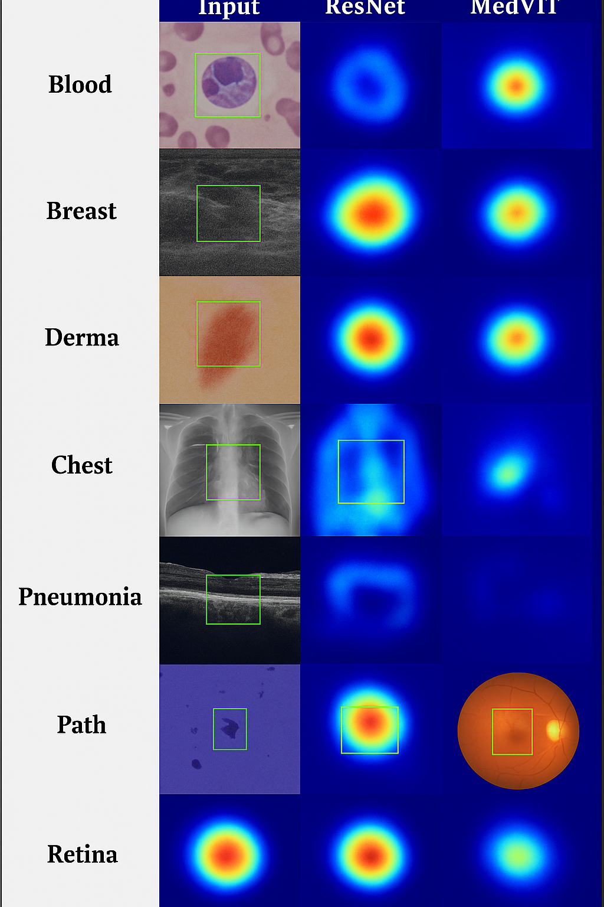
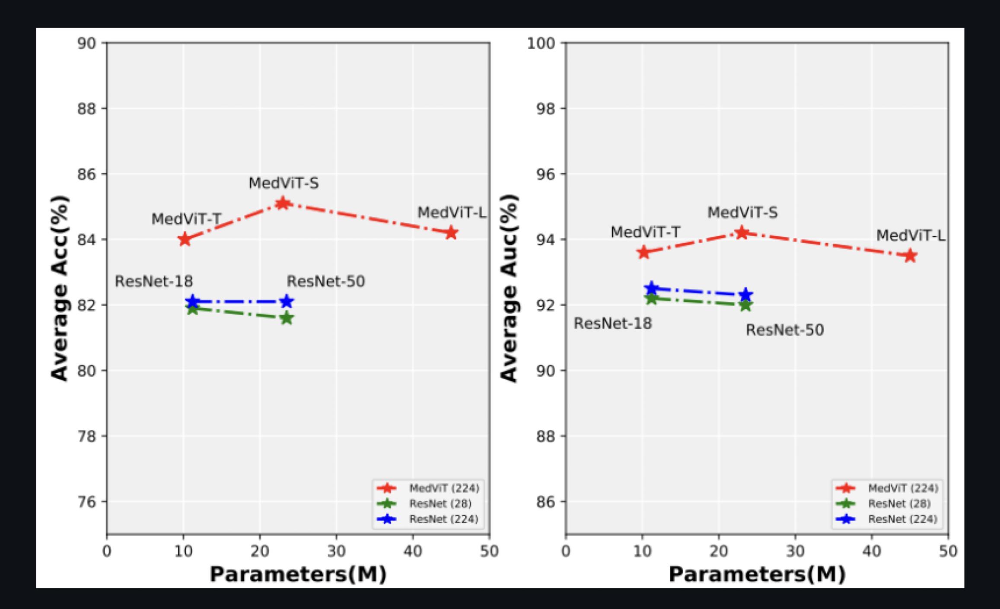

# MedViT-X: Vision Transformer for Explainable Medical Imaging

## Overview

MedViT-X is a hybrid vision architecture that integrates convolutional neural networks (CNNs) with Vision Transformers (ViTs) to perform accurate and interpretable classification across multiple medical imaging modalities. This project investigates the performance of MedViT-X on diverse diagnostic datasets, comparing its effectiveness to standard ResNet baselines using both classification accuracy and visual explainability through attention heatmaps.

## Key Features

- **Hybrid Architecture**: Combines local inductive bias of CNNs with global attention modeling of ViTs.
- **Multi-Domain Evaluation**: Tested across varied medical imaging datasets such as blood smears, breast ultrasounds, dermoscopy, chest X-rays, OCT scans, pathology slides, and retinal images.
- **Explainable AI (XAI)**: Visualizes attention maps using Grad-CAM to highlight pathology-relevant regions, improving transparency for clinical use.
- **Efficient Inference**: Achieves competitive accuracy and AUC with reduced model complexity compared to pure transformer or CNN approaches.

## Visual Comparison: Input vs ResNet vs MedViT-X

The following composite illustrates the difference in attention focus across medical modalities:



## Performance Evaluation

MedViT-X consistently outperforms ResNet baselines across accuracy and AUC while maintaining similar parameter efficiency.



## Architecture Overview

MedViT-X employs a multi-stage feature extraction pipeline that uses convolutional stem blocks followed by transformer-based attention layers. Each stage embeds patches and applies both Efficient Convolutional Blocks (ECB) and Lightweight Transformer Blocks (LTB) to extract local and global features.

## Technology Stack

- Python, PyTorch
- Vision Transformer (ViT), ResNet-18, ResNet-50
- Grad-CAM for model interpretability
- Jupyter/Colab Notebooks

## Getting Started

```bash
# Clone the repository
git clone https://github.com/your-username/MedViT-X.git
cd MedViT-X

# Install dependencies
pip install -r requirements.txt

# Run the notebook
jupyter notebook Colab_MedViT.ipynb
```

## Project Structure

- `MedViT.py` — Main model architecture
- `utils.py` — Helper functions and visualization utilities
- `Colab_MedViT.ipynb` — End-to-end training and evaluation pipeline
- `CustomDataset/` — Custom dataset loading module

## Citation

This project is adapted from the original [MedViT repository](https://github.com/Omid-Nejati/MedViT). If you use this work in research, please cite the original authors.

## Contact

For questions, collaboration, or feedback, please contact Harshini Pothireddy via [LinkedIn](https://www.linkedin.com/in/harshini-pothireddy).
